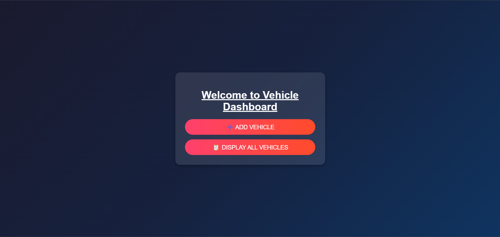
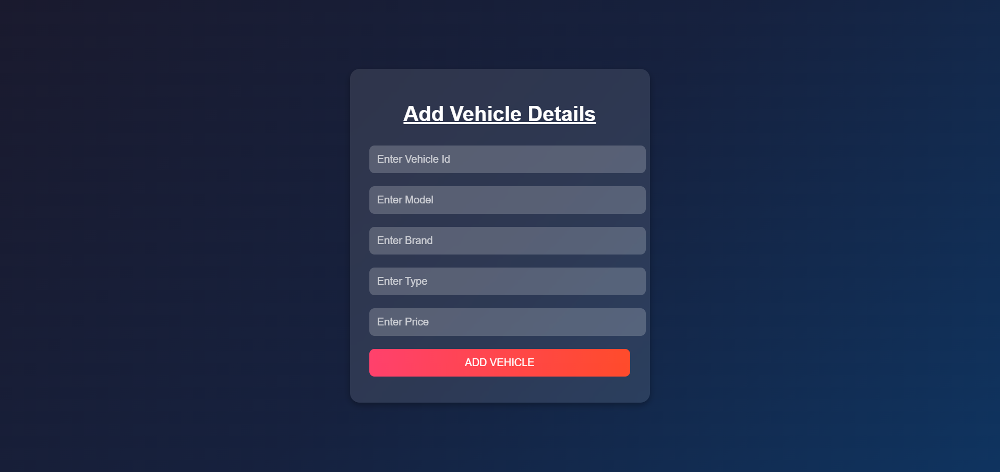
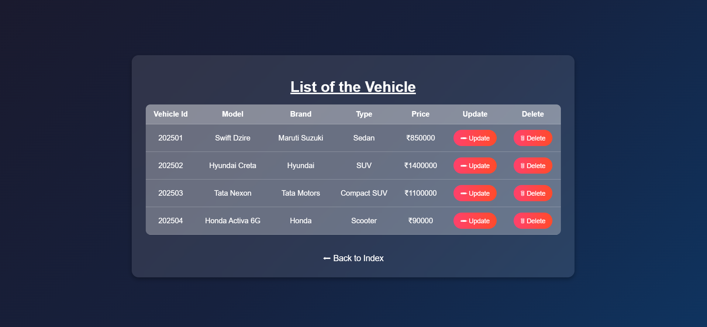

## 🚗 Vehicle Management System 

### Overview
The Vehicle Management System is a web-based application designed to store, manage, and track vehicle details efficiently. Built using Spring MVC, JSP, Hibernate, and MySQL, this system allows users to add, update, delete, and view vehicle records seamlessly.

This project is ideal for car dealerships, rental services, or fleet management companies that need a streamlined database-driven system for handling vehicle data.

### 🔹 Key Highlights
✔ Efficient Data Management – Store and retrieve vehicle information easily.
✔ User-Friendly Interface – Responsive UI designed for a smooth user experience.
✔ Spring MVC Architecture – Follows MVC for clear separation of concerns.
✔ Hibernate ORM – Ensures seamless database interactions.
✔ MySQL Database – Reliable storage for vehicle records.
✔ CRUD Operations – Perform Create, Read, Update, Delete operations on vehicle data.

### 🛠️ How It Works?
1️⃣ User adds a new vehicle with details like model, brand, type, and price.
2️⃣ Stored in MySQL using Hibernate ORM.
3️⃣ User can view all vehicles in a dynamic table format.
4️⃣ Edit or delete any vehicle data as required

## 📁 Project Structure
Below is a text-based representation of the project structure, similar to the provided screenshot:.

SpringMVC_VMS/
├─ src
│  ├─ main
│  │  ├─ java
│  │  │  └─ com.jsp.spring.vms
│  │  │     ├─ AppConfig.java
│  │  │     ├─ WebInitializer.java
│  │  │     ├─ controller
│  │  │     │  └─ VehicleController.java
│  │  │     ├─ repository
│  │  │     │  └─ VehicleRepository.java
│  │  ├─ resources
│  │  ├─ webapp
│  │  │  ├─ css
│  │  │  ├─ WEB-INF
│  │  │  ├─ addVehicle.jsp
│  │  │  ├─ displayAllVehicles.jsp
│  │  │  ├─ index.jsp
│  │  │  └─ updateVehicleById.jsp
│  ├─ test
├─ target
└─ pom.xml

## Notable Files
AppConfig.java: Spring configuration class.
WebInitializer.java: Replaces web.xml, configuring the servlet container.
VehicleController.java: Manages incoming HTTP requests and responses.
VehicleRepository.java: Handles data persistence with Hibernate.

### JSP Files:
index.jsp – Home page / Dashboard.
addVehicle.jsp – Form for adding a new vehicle.
displayAllVehicles.jsp – Displays all vehicles in a table.
updateVehicleById.jsp – Form to update existing vehicle details.

# 🛠️ Usage
Add a Vehicle: Go to the "Add Vehicle" page, fill out the form, and submit.
Display All Vehicles: View the complete list of vehicles with their details.
Update Vehicle: Click on "Update" next to a vehicle to modify its details.
Delete Vehicle: Click on "Delete" next to a vehicle to remove it from the database.

### Expected Output

